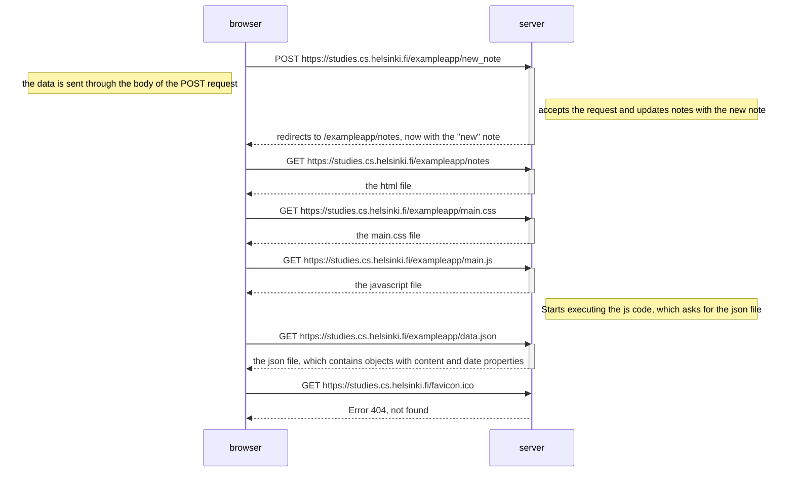

```mermaid
sequenceDiagram
  participant browser
  participant server
  
  browser ->> server: POST https://studies.cs.helsinki.fi/exampleapp/new_note
  activate server 
  Note left of browser: the data is sent through the body of the POST request
  Note right of server: accepts the request and updates notes with the new note
  server -->> browser: redirects to /exampleapp/notes, now with the "new" note
  deactivate server
  
  
  browser ->> server: GET https://studies.cs.helsinki.fi/exampleapp/notes
  activate server 
  server -->> browser: the html file
  deactivate server
  
  browser ->> server: GET https://studies.cs.helsinki.fi/exampleapp/main.css
  activate server 
  server -->> browser: the main.css file
  deactivate server
  
  browser ->> server: GET https://studies.cs.helsinki.fi/exampleapp/main.js
  activate server 
  server -->> browser: the javascript file
  deactivate server
  
  Note right of server: Starts executing the js code, which asks for the json file
  
  browser ->> server: GET https://studies.cs.helsinki.fi/exampleapp/data.json
  activate server 
  server -->> browser: the json file, which contains objects with content and date properties
  deactivate server
  
  browser ->> server: GET https://studies.cs.helsinki.fi/favicon.ico
  activate server
  server -->> browser: Error 404, not found
```
